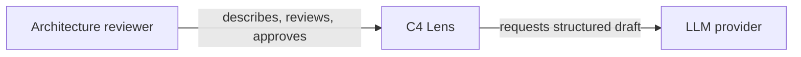

# System Context

```mermaid
flowchart LR
  U[Architecture reviewer] -->|describes, reviews, approves| C[C4 Lens]
  C -->|requests structured draft| L[LLM provider]
```

C4 Lens is a review-first diagramming tool. Its only justified external dependency is the configured LLM provider. No runtime containers are asserted at this stage.
